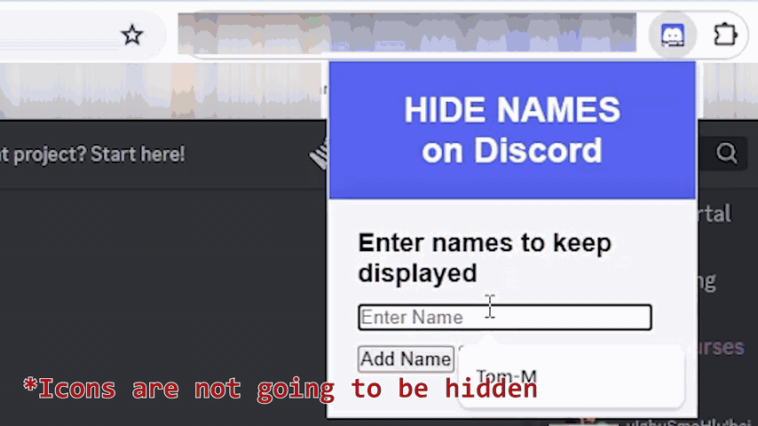

# Hide Names on Discord — for Browser

*Currently in testing beta.

This is a free Chrome extension built in simple JavaScript used on Discord to hide/censor user names with asterisks (`*`) displaying the first few letters and adding a number unique to each different name to the end, while keeping specified names displayed. It is only available on **the browser version** of Discord. (Tested in Chrome ver. 124.0.6367.201)

Especially useful for screen recording on Discord when other people's privacy is concerned.

Hidden names e.g. `NameOnDiscord`, will look like this: `Na***********(1286)`.

*Video/image blurs icons for privacy but it's not part of the app.

- [Hide Names on Discord — for Browser](#hide-names-on-discord--for-browser)
	- [Main features](#main-features)
	- [Installation](#installation)
	- [Usage](#usage)
	- [Limitation](#limitation)
	- [Known issues](#known-issues)
	- [License](#license)
	- [Credit](#credit)

## Main features
- Hiding user names on Discord server, including:
  - a memberlist
  - audience in a live/voice channel
  - a chat timeline, replys/mentions (except for channel names)
  - (who)'s *typing* below the input box.
- Hide with asterisks
- Display the first `1`(for CJK characters)/`2`(for alphanumeric) characters and hide the others
- Unique ID numbers so that names starting with the same 1 or 2 letters are distinguishable.

When specified names to display, all other user names are going to be censored with asterisks `*`.
A unique sequence of numbers is added to the end of each name. The same name will always have the name number.

## Installation
Go to the [Chrome extension page](https://chromewebstore.google.com/detail/lhehmhaancalbdmbleclceijldnfkkbp) on Chrome Web Store and add the extension to your browser.

## Usage
After installing the extension, open a tab accessing `discord.som/channels/`, then open the extension popup menu, type in names you want to keep displayed and press the Apply button.
The program execution only works on discord servers.

*Try reloading the Discord page first before use.

## Limitation
There are limitations:

1. If the original name looks like this: `Na*******(1)`, (i.e. starting with 1 or 2 letters followed by asterisks then numbers in parenthesis and nothing after that),
the name is not going to be censored but displayed as-is.
The logic is simple: It first checks if the original name matches a specific string pattern. If matches, ignores, if not, porceeds to modification.

2. Also, if the original name is **exactly the same as another**, their ID numbers are going to be exactly the same. Because simply it generates a unique number by calculating the sum of ASCII code of each letter. The unique number is intended to make names starting with the same letters, distinguishable, but if the names are entirely the same all along, the number becomes meaningless.

3. If there are a massive number of user names—including the same names—like, say `10,000` entries, detected at once on your server (it actually happens), it might lead to high CPU/memory usage.

4. Also if there's an excesive level of activity on your computer or such a large number of names being detected, while the extension is running, the names might sometimes show up uncensored in a blink.

5. Names which are specified are also hidden in _mentions_ that is expected.

## Known issues
In very rare cases some names won't be hidden but the matching pattern for it is still unknown.

## License
`GPL-3.0` 
Licensed under GNU General Public License v3.0.

## Credit
Morioka, Tomoaki (森岡 知映.) (2024).